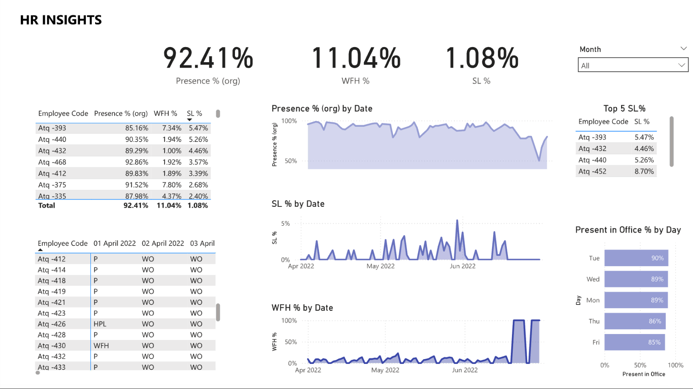

# HR_Analytics_Dashborad
A collection of Power BI dashboards focused on key HR metrics and insights.

## 📊 Included Dashboards

### 1. [Presence Insights Dashboard](https://github.com/anaghasanthoshh/HR_Analytics_Dashborad/tree/f6eee5fa6d411568fee4d3f44e62009b057b260a/Presence%20Insights%20Dashboard)
This Power BI dashboard provides a clear and insightful view of employee presence patterns over time. It is designed for HR teams to monitor in-office presence, remote work trends, and sick leave behavior across the organization.

---
## 📸 Dashboard Preview

*Overview of the Presence Insights Dashboard showing key metrics and trends*

##  Report Contents

- **Overall Presence % (Org-wide)**  
  Total presence across the selected time period.

- **WFH % and SL %**  
  Organization-wide summary of work-from-home and sick leave days.

- **Presence % by Employee**  
  Table showing each employee’s presence, WFH %, and SL % with overall totals.

- **Trend Visuals (Line Charts)**  
  Daily changes in:
  - Presence %  
  - SL %  
  - WFH %

- **Top 5 Employees by Sick Leave %**  
  Highlights employees with the highest proportion of sick leave.

- **Presence in Office % by Day (Bar Chart)**  
  Shows average in-office presence by day of the week (Mon–Fri).

- **Daily Status Log Table**  
  Matrix displaying daily attendance codes (P, WFH, WO, HPL, etc.) for each employee.

---

##  Insights Delivered

- Track which days have the **lowest in-office presence**
- Spot **WFH or SL spikes** by date
- Identify **employees with higher-than-usual SL usage**
- Understand **weekly presence behavior**

